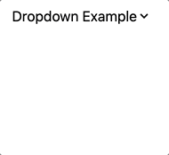

# Dropdown Component



## Usage

```javascript
import { Dropdown } from "tailwindcss-stimulus-components"
application.register('dropdown', Dropdown)
```

```html
<div data-controller="dropdown" data-action="click->dropdown#toggle click@window->dropdown#hide">
  <div id="dropdown-button" class="relative inline-block">
    <div role="button" tabindex="0" data-dropdown-target="button" class="inline-block select-none">
      <span class="appearance-none flex items-center inline-block">
        <span>Dropdown Example</span>
        <svg xmlns="http://www.w3.org/2000/svg" viewBox="0 0 20 20" class="fill-current h-4 w-4"><path d="M9.293 12.95l.707.707L15.657 8l-1.414-1.414L10 10.828 5.757 6.586 4.343 8z"></path></svg>
      </span>
    </div>
    <div data-dropdown-target="menu"
          data-transition-enter="transition ease-out duration-200"
          data-transition-enter-from="opacity-0 translate-y-1"
          data-transition-enter-to="opacity-100 translate-y-0"
          data-transition-leave="transition ease-in duration-150"
          data-transition-leave-from="opacity-100 translate-y-0"
          data-transition-leave-to="opacity-0 translate-y-1"
          class="hidden absolute top-4 right-0 z-10 mt-5 flex w-screen max-w-max">
      <div class="text-sm bg-white shadow-lg rounded border overflow-hidden w-32">
        <a href="#" class='no-underline block pl-4 py-2 text-gray-900 bg-white hover:bg-gray-100 whitespace-no-wrap'>Account</a>
        <a href="#" class='no-underline block pl-4 py-2 text-gray-900 bg-white hover:bg-gray-100 whitespace-no-wrap'>Billing</a>
        <a href="#" class='no-underline block pl-4 py-2 text-gray-900 bg-white hover:bg-gray-100 whitespace-no-wrap border-t'>Sign Out</a>
      </div>
    </div>
  </div>
</div>
```

Dropdowns are set up to toggle if you click on the dropdown button or any of the
options with in the dropdown menu (via `data-action="click->dropdown#toggle`).
It will also close if you click anywhere outside of the dropdown. This is
done using a window click event to check if the user clicked outside the
dropdown (`data-action="click@window->dropdown#hide"`).

Users can also focus on the dropdown button if `tabindex="0"` is included. They can toggle the dropdown with Space or Enter if the attribute `data-dropdown-target="button"` is included on the button.

If you want a dropdown to be opened on page load you can set the ```data-dropdown-open-value="true"``` as a data attribute.

The code above will toggle the dropdown component, if you needed to only perform a single action, such as `show` or `hide`. the dropdown component exposes such method.

```html
data-action="click->dropdown#show"
data-action="click->dropdown#hide"
```