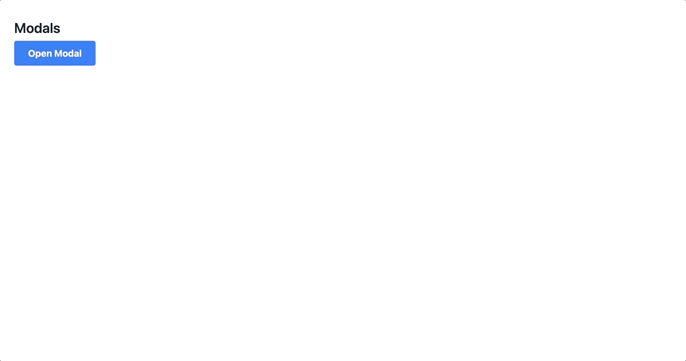

# Modal Component



## Usage

```javascript
import { Modal } from "tailwindcss-stimulus-components"
application.register('modal', Modal)
```

```html
<div data-controller="modal">
  <dialog data-modal-target="modal" class="p-8 rounded-lg backdrop:bg-black/80">
    <p>This modal dialog has a groovy backdrop!</p>
    <button autofocus data-action="modal#close" class="px-2.5 py-1 bg-blue-500 text-white text-sm rounded">Close</button>
  </dialog>

  <button data-action="modal#open" class="bg-blue-500 hover:bg-blue-700 text-white text-sm font-bold py-1 px-2.5 rounded">Open modal</button>
</div>
```

`data-modal-open-value` may be set to `true` to open modal on connect.
