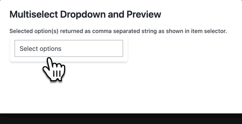

# Multi-select Component



## Usage

```javascript
import { MultiSelect } from 'tailwindcss-stimulus-components'
application.register('multi-select', MultiSelect)
```

```html
<div data-controller="multi-select" class="relative">
  <div
    data-action="click->multi-select#toggle"
    class="border rounded-md p-3 bg-white shadow-md cursor-pointer"
  >
    <input
      readonly
      name="selected_tag_names"
      data-multi-select-target="selectedItems"
      class="text-gray-600"
      placeholder="Select options"
    />
  </div>
  <div
    data-multi-select-target="options"
    class="absolute left-0 right-0 mt-1 hidden bg-white border rounded-md shadow-lg z-10"
  >
    <div class="p-2">
      <label class="flex items-center">
        <input
          type="checkbox"
          value="Option 1"
          data-action="change->multi-select#updateSelection"
          class="mr-2"
        />
        Option 1
      </label>
      <label class="flex items-center">
        <input
          type="checkbox"
          value="Option 2"
          data-action="change->multi-select#updateSelection"
          class="mr-2"
        />
        Option 2
      </label>
      <label class="flex items-center">
        <input
          type="checkbox"
          value="Option 3"
          data-action="change->multi-select#updateSelection"
          class="mr-2"
        />
        Option 3
      </label>
    </div>
  </div>
</div>
```

Multi-select options are set up to toggle on click. Selected options may be accessed as a concatenated string returned from this input.

```html
<input
  readonly
  name="selected_tag_names"
  data-multi-select-target="selectedItems"
  class="text-gray-600"
  placeholder="Select options"
/>
```

Selected options read from memory will be automatically checked.
