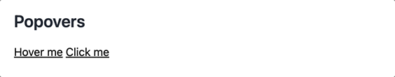

# Popover Component



## Usage

```javascript
import { Popover } from "tailwindcss-stimulus-components"
application.register('popover', Popover)
```

```html
<div class="inline-block relative cursor-pointer" data-controller="popover" data-action="mouseenter->popover#show mouseleave->popover#hide">
  <span class="underline">Hover me</span>
  <div class="hidden absolute left-0 bottom-7 w-max bg-white border border-gray-200 shadow rounded p-2"
       data-popover-target="content"
       data-transition-enter="transition-opacity ease-in-out duration-300"
       data-transition-enter-from="opacity-0"
       data-transition-enter-to="opacity-100"
       data-transition-leave="transition-opacity ease-in-out duration-300"
       data-transition-leave-from="opacity-100"
       data-transition-leave-to="opacity-0"
    >
    This popover shows on hover
  </div>
</div>
```

`data-popover-target="content"` defines which element will contain the actual content in the popover.

`data-popover-dismiss-after-value` can be provided to make the popover dimiss after x miliseconds. Default is `undefined`.
