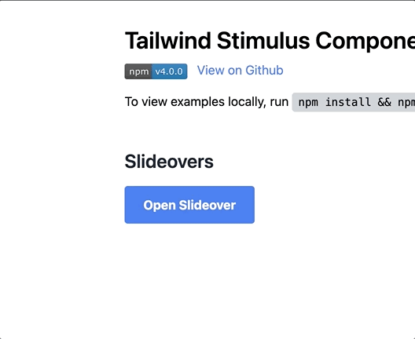

# Slideover Component



Slideovers are just modals with a different design.

## Usage

```js
import { Slideover } from "tailwindcss-stimulus-components"
application.register('slideover', Slideover)
```

```html
<div data-controller="slideover">
  <style>
    dialog.slideover[open] {
      animation: slide-in-from-left 250ms forwards ease;
    }

    @keyframes slide-in-from-left{
      from {
        transform: translateX(-100%);
      }
    }
  </style>
  <dialog data-slideover-target="dialog" class="slideover h-full max-h-full m-0 w-96 p-8 backdrop:bg-black/80">
    <p>This slideover dialog has a groovy backdrop!</p>
    <button autofocus data-action="slideover#close" class="px-2.5 py-1 bg-blue-500 text-white text-sm rounded">Close</button>
  </dialog>
  <button data-action="slideover#open" class="bg-blue-500 hover:bg-blue-700 text-white text-sm font-bold py-1 px-2.5 rounded">Open slideover</button>
</div>
```

### Options

`data-slideover-open-value` may be set to `true` to open slideover on connect.
