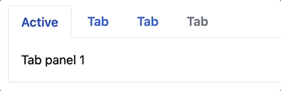

# Tabs Component



## Usage

```javascript
import { Tabs } from "tailwindcss-stimulus-components"
application.register('tabs', Tabs)
```

```html
<div data-controller="tabs" data-tabs-active-tab="-mb-px border-l border-t border-r rounded-t">
  <ul class="list-reset flex border-b">
    <li class="-mb-px mr-1" data-tabs-target="tab" data-action="click->tabs#change">
      <a class="bg-white inline-block py-2 px-4 text-blue-500 hover:text-blue-700 font-semibold no-underline" href="#">Active</a>
    </li>
    <li class="mr-1" data-tabs-target="tab" data-action="click->tabs#change">
      <a class="bg-white inline-block py-2 px-4 text-blue-500 hover:text-blue-700 font-semibold no-underline" href="#">Tab</a>
    </li>
    <li class="mr-1" data-tabs-target="tab" data-action="click->tabs#change">
      <a class="bg-white inline-block py-2 px-4 text-blue-500 hover:text-blue-700 font-semibold no-underline" href="#">Tab</a>
    </li>
    <li class="mr-1">
      <a class="bg-white inline-block py-2 px-4 text-gray-300 font-semibold no-underline" href="#">Tab</a>
    </li>
  </ul>

  <div class="hidden py-4 px-4 border-l border-b border-r" data-tabs-target="panel">
    Tab panel 1
  </div>

  <div class="hidden py-4 px-4 border-l border-b border-r" data-tabs-target="panel">
    Tab panel 2
  </div>

  <div class="hidden py-4 px-4 border-l border-b border-r" data-tabs-target="panel">
    <iframe width="560" height="315" src="https://www.youtube.com/embed/y3niFzo5VLI" frameborder="0" allow="autoplay; encrypted-media" allowfullscreen></iframe>
  </div>
</div>
```

`data-tabs-target="tab"` defines which element is marked as a tab. The index of the tab is used to determine which panel to make visible.

`data-tabs-target="panel"` defines which panel is visible based upon the currently selected tab.

`data-tabs-active-tab-class` defines the list of classes that will be added/removed from the active tab when the active tab changes.

`data-tabs-inactive-tab-class` defines the list of classes that will be added/removed from the inactive tab when the active tab changes.

`data-tabs-index-value="1"` can be used to set the selected tab when the controller connects.

`data-tabs-update-anchor-value="true"` can be used to update the URL anchor when the tab changes.

##### Changing tabs from other places

If you'd like to change the tab from a button or link outside of the tabs, you can call the same method and assign either `data-id` or `data-index` to select the tab.

```html
<a data-action="click->tabs#change" data-index="1">Change tab by data-index</a>

<a data-action="click->tabs#change" data-id="second">Change tab by data-id</a>
```
