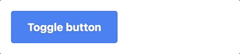

# Toggle Component



## Usage

```js
import { Toggle } from "tailwindcss-stimulus-components"
application.register('toggle', Toggle)
```

```html
<div data-controller='toggle' class="m-2">
  <div data-action='click->toggle#toggle touch->toggle#toggle' class="bg-gray-900 text-white p-6">
    What is the question?
  </div>
  <div data-toggle-target='toggleable' class="m-4 hidden">
    <p>This is the answer</p>
  </div>
</div>
```

In this example, clicking the question will toggle the hidden class. The hidden class is the default. If you wish to use a different class, you can use the `data-toggle-class="custom-class"` attribute.

```html
<div data-controller='toggle' class="m-2">
  <div data-action='click->toggle#toggle touch->toggle#toggle' class="bg-gray-900 text-white p-6">
    What is the question?
  </div>
  <div data-toggle-target='toggleable' data-toggle-class='bg-red-900' class="m-4 bg-red-900">
    <p>This is the answer</p>
  </div>
</div>
```

On some cases, you don't want to toggle something but rather do one action such as only show or hide the toggleable. the toggle controller exposes two such methods named `hide` and `show`

this will only hide the toggleable.
```html
  <div data-action='click->toggle#hide touch->toggle#hide' class="bg-gray-900 text-white p-6">
    What is the question?
  </div>

```
while this only shows it
```html
  <div data-action='click->toggle#show touch->toggle#show' class="bg-gray-900 text-white p-6">
    What is the question?
  </div>

```
